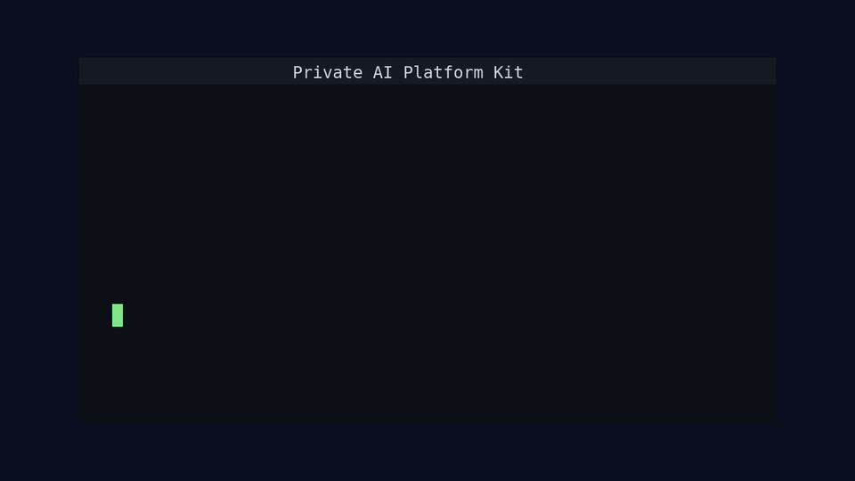
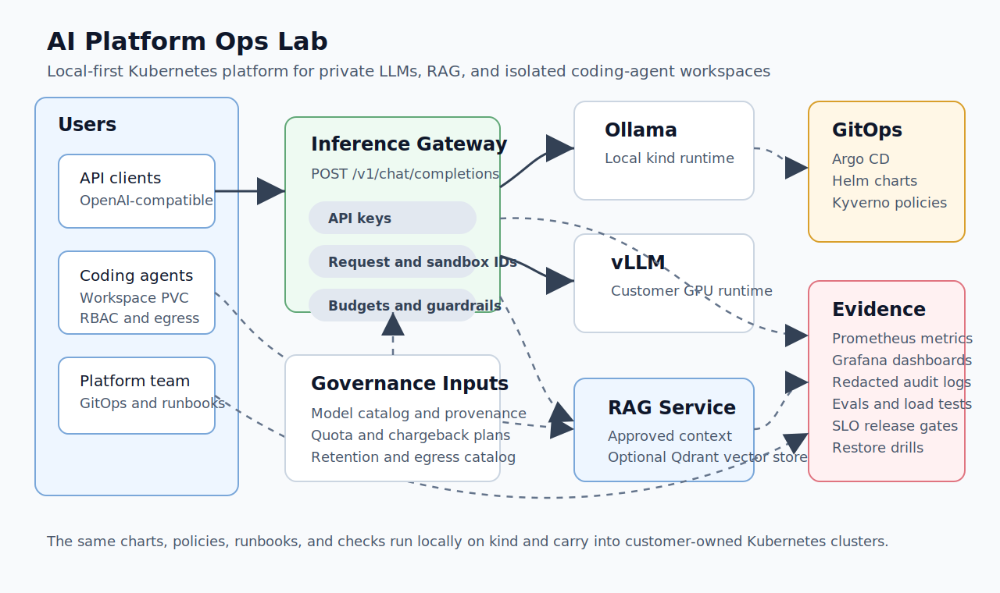

# Private AI Platform Kit: Local-First Kubernetes for Private LLMs

[](https://github.com/RamazanKara/private-ai-platform-kit/actions/workflows/ci.yml)
[](https://github.com/RamazanKara/private-ai-platform-kit/releases)
[](LICENSE)
[](https://doi.org/10.5281/zenodo.21039342)


Private AI Platform Kit is a runnable Kubernetes platform stack for private LLMs, RAG, and coding-agent workspaces. It starts on a local `kind` cluster with Ollama, then uses the same Helm charts, GitOps layout, policies, runbooks, and evidence checks on customer-owned clusters with vLLM and GPU nodes.

It is designed for teams that want the operating model of a production AI platform without depending on a specific cloud provider.

Current release: `v0.11.0`. Maturity: reference implementation and customer lab; production handoff requires current strict evidence, customer identity/secrets integration, capacity sizing, and backup validation.

[Docs site](https://ramazankara.github.io/private-ai-platform-kit/) | [Quickstart](docs/quickstart.md) | [Decision guide](docs/decision-guide.md) | [Production readiness](docs/production-readiness.md) | [Proof](docs/proof.md) | [Runbooks](docs/README.md) | [Contributing](CONTRIBUTING.md) | [Security](SECURITY.md)

## Live Demo

<p align="center">
  
</p>

The demo is generated from [scripts/demo-live.sh](scripts/demo-live.sh).

## What You Get

- OpenAI-compatible gateway for private chat-completion traffic.
- Local Ollama profile for fast laptop demos and vLLM profiles for NVIDIA or AMD GPU clusters.
- Multi-replica gateway and runtime options with HPA, PodDisruptionBudgets, topology spread, and shared Redis-backed sandbox budgets.
- Locked-down coding-agent workspaces with namespace isolation, PVC storage, RBAC, quotas, default-deny networking, approved egress, and RAG access.
- RAG service with local lexical retrieval and an optional Qdrant vector-store profile for customer knowledge bases.
- Model governance with approved-only gateway allowlists, promotion requests, provenance records, and eval suites.
- Operational controls for SLOs, release gates, quota and chargeback, data retention, egress governance, restore drills, chaos drills, evidence packs, SBOMs, scans, signed images, provenance attestations, and OpenSSF Scorecard.

## How It Works



Requests enter the inference gateway at `POST /v1/chat/completions`. The gateway forwards traffic to Ollama or vLLM based on `RUNTIME_BACKEND`, enforces model allowlists and admission limits, records Prometheus metrics, and emits redacted audit events. Callers can pass `X-Request-ID`, `X-Sandbox-ID`, and W3C `traceparent`; the gateway returns and forwards those headers without logging raw prompt text.

The local lab runs fully on `kind`. Customer clusters keep the same repo structure and replace only the platform services they already operate: ingress, storage classes, secret backends, logging, observability, and GPU node pools.

## Run It Locally

For a guided first run:

```bash
make quickstart
```

Use `QUICKSTART_INSTALL_TOOLS=1 make quickstart` to install optional validation CLIs into `.tools/bin`, or `QUICKSTART_DIRECT_APPLY=1 make quickstart` to use direct Helm apply instead of Argo CD for a workstation check.

Install or verify the local toolchain:

```bash
make toolchain-doctor
make toolchain-install
```

Make targets and repo scripts automatically discover tools installed under `.tools/bin`.

Validate the repo without a live cluster:

```bash
make validate
make quality
make production-check
make repo-hygiene
make api-contract
make config-contract
```

Start the local platform and run an Ollama-backed smoke test:

```bash
make local-up
make bootstrap-argocd
make sync
make smoke RUNTIME_BACKEND=ollama
```

The default local model is `qwen2.5:0.5b`, a fast non-reasoning model that keeps the laptop CPU smoke quick; the larger `qwen3.5:0.8b` reasoning model is the customer Ollama profile default. A real model pull can take time and disk space on the first run.

For expected output, timing, disk requirements, and troubleshooting, follow [docs/quickstart.md](docs/quickstart.md). For the full local path, including sandbox tracing, RAG, coding-agent workspaces, restore drills, evals, load tests, and release gates, follow [docs/getting-started.md](docs/getting-started.md).

## Support Boundaries

This project provides Kubernetes manifests, Helm charts, service code, validation tooling, and operational runbooks. It does not provision cloud infrastructure, operate your Kubernetes cluster, host customer models, or replace your identity provider, secret manager, logging stack, backup platform, or incident process.

Use [docs/decision-guide.md](docs/decision-guide.md) to decide whether the kit is a fit before adopting it.

## Customer-Owned Kubernetes

The customer profile assumes Kubernetes already exists. Install Argo CD, configure the customer GitOps overlay, and apply the customer values under [deploy/clusters/customer](deploy/clusters/customer/).

```bash
make customer-overlay \
  CUSTOMER_REPO_URL=https://github.com/<customer>/<repo>.git \
  CUSTOMER_REVISION=v0.10.0 \
  CUSTOMER_GPU_PROFILE=nvidia
```

NVIDIA clusters should expose `nvidia.com/gpu`; AMD clusters should expose `amd.com/gpu`. Label GPU nodes with `platform.ai/node-pool=gpu` and `platform.ai/gpu-vendor=<nvidia|amd>`, then use:

- [deploy/clusters/customer/values/vllm-nvidia.yaml](deploy/clusters/customer/values/vllm-nvidia.yaml)
- [deploy/clusters/customer/values/vllm-amd.yaml](deploy/clusters/customer/values/vllm-amd.yaml)

The default customer vLLM profile targets `Qwen/Qwen3-Coder-Next` for coding-agent workloads. Tune replica count, context length, tensor parallelism, and GPU requests to the customer cluster before production use.

## Docs

| Need | Start here |
| --- | --- |
| First local run | [Quickstart](docs/quickstart.md) |
| Full local workflow | [Getting started](docs/getting-started.md) |
| Project fit | [Decision guide](docs/decision-guide.md) |
| Production controls | [Production readiness matrix](docs/production-readiness.md) |
| Current proof and strict evidence | [Project proof](docs/proof.md) |
| Threat model | [Threat model](docs/threat-model.md) |
| Benchmarks and evals | [Benchmarks and evals](docs/benchmarks-and-evals.md) |
| API contracts | [API contract snapshots](platform/api-contracts/README.md) |
| Configuration contracts | [Configuration contract snapshots](platform/config-contracts/README.md) |
| Full documentation map | [Docs index](docs/README.md) |
| Contributor workflow | [Contributing](CONTRIBUTING.md) |
| Security policy | [Security](SECURITY.md) |
| Governance | [Governance](GOVERNANCE.md) |
| Roadmap | [Roadmap](ROADMAP.md) |
| Customer cluster assumptions | [Customer cluster README](deploy/clusters/customer/README.md) |
| Customer handoff example | [Customer handoff example](docs/customer-handoff-example.md) |
| Regulated offline tenant example | [Regulated offline tenant](docs/regulated-offline-tenant-example.md) |
| GPU coding-agent tenant example | [GPU coding-agent tenant](docs/gpu-coding-agent-tenant-example.md) |
| Restore verification | [Restore drill runbook](runbooks/restore-drill.md) |
| Coding-agent workspaces | [Agent workspaces runbook](runbooks/agent-workspaces.md) |
| Model governance | [Model governance runbook](runbooks/model-governance.md) |
| OIDC / JWKS rotation | [OIDC/JWKS rotation runbook](runbooks/oidc-jwks-rotation.md) |
| OpenSSF Scorecard triage | [Scorecard triage runbook](runbooks/scorecard-triage.md) |
| Qdrant collection migration | [Qdrant migration runbook](runbooks/qdrant-migration.md) |
| Upstream references | [References](docs/references.md) |

## Repo Map

| Path | Purpose |
| --- | --- |
| `deploy/charts/` | Helm charts for gateway, runtimes, RAG, vector store, budget Redis, and agent workspaces |
| `deploy/clusters/local/` | Local `kind` and Argo CD values |
| `deploy/clusters/customer/` | Provider-neutral customer cluster values |
| `src/` | Gateway and RAG service code |
| `platform/api-contracts/` | Versioned OpenAPI snapshots for customer-facing services |
| `platform/config-contracts/` | Versioned runtime configuration snapshots for services and Helm charts |
| `runbooks/` | Operational procedures and incident drills |
| `platform/governance/`, `platform/model-catalog/`, `platform/network/`, `platform/slo/` | Reviewed policy and evidence inputs |
| `results/` | Sample evidence artifacts; generated reports are ignored by default |
| `deploy/backup/restore-drill/` | Restore-drill wrapper around `RamazanKara/restore-drill` |

## Evidence Commands

```bash
make evidence
make release-gate
make release-gate-strict
make slo-check
make quota-check
make model-check
make model-provenance-check
make loadtest-local
make eval-local
make toolchain-report TOOLCHAIN_PROFILE=strict
make api-contract
make config-contract
make image-scan
make supply-chain-check
```

Runtime images use a pinned Alpine Python base and exclude test-only dependencies. Local image scans generate SBOM, SARIF, checksum, and summary evidence under `results/supply-chain/`. CI builds and pushes gateway and RAG images, packages Helm charts as OCI artifacts, generates SBOMs, fails on high/critical Trivy findings, uploads SARIF, signs immutable image digests with Cosign, and publishes downloadable supply-chain evidence for release reviews.

## Trademark Notice

Kubernetes is a registered trademark of The Linux Foundation. Private AI Platform Kit is not affiliated with or endorsed by The Linux Foundation.
