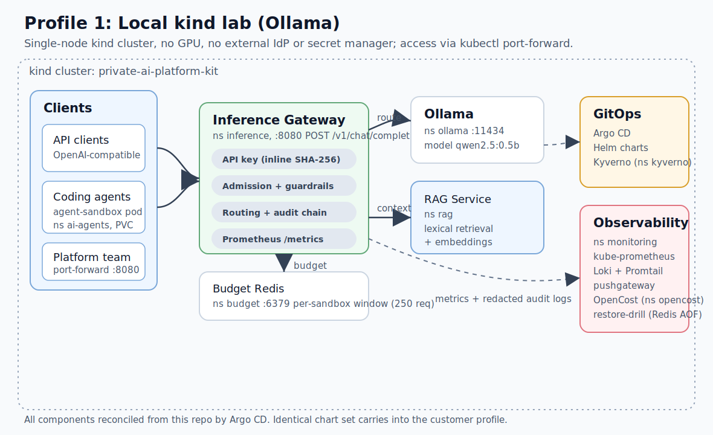
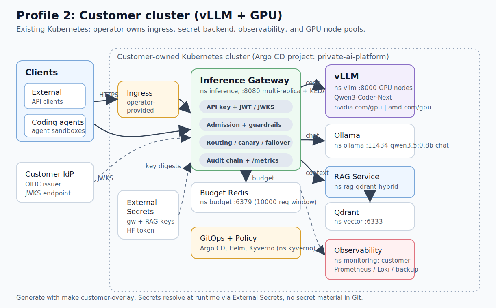
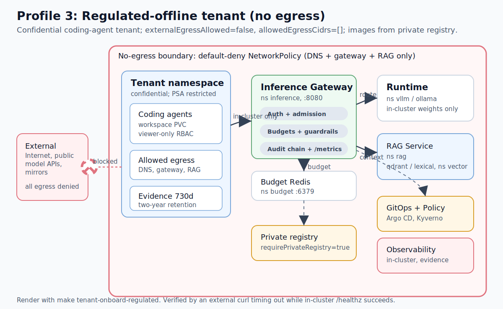

# Architecture And Deployment Profiles

This document describes the runtime architecture of the Private AI Platform Kit across the three
deployment profiles the repo ships values for: the local `kind`/Ollama lab, the customer
cluster/vLLM+GPU profile, and a regulated-offline tenant profile. The component set and GitOps
layout are identical across profiles; what changes is the runtime backend, the namespaces that are
operator-owned versus kit-owned, the secret backend, and the network egress posture.

For the single combined overview diagram see [`assets/architecture.svg`](assets/architecture.svg). For
the high-level narrative see the [README "How It Works" section](https://github.com/RamazanKara/private-ai-platform-kit/blob/main/README.md). Whether the kit fits
your use case is covered in the [decision guide](decision-guide.md); the trust boundaries are in the
[threat model](threat-model.md).

## Components Common To Every Profile

Every profile deploys the same Argo CD `Application` set (`deploy/clusters/local/apps.yaml` and
`deploy/clusters/customer/apps.yaml`). The kit-owned workloads and their namespaces are:

| Component | Namespace | Service (in-cluster DNS) | Source |
| --- | --- | --- | --- |
| Inference gateway | `inference` | `inference-gateway-inference-gateway.inference.svc.cluster.local:8080` | `deploy/charts/inference-gateway` |
| RAG service | `rag` | `rag-service.rag.svc.cluster.local` | `deploy/charts/rag-service` |
| Qdrant vector store (optional) | `vector` | `qdrant-vector-store.vector.svc.cluster.local:6333` | `deploy/charts/qdrant-vector-store` |
| Budget Redis | `budget` | `budget-redis.budget.svc.cluster.local:6379` | `deploy/charts/budget-redis` |
| Ollama runtime | `ollama` | `ollama.ollama.svc.cluster.local:11434` | `deploy/charts/ollama` |
| vLLM runtime | `vllm` | `vllm.vllm.svc.cluster.local:8000` | `deploy/charts/vllm` |
| Agent workspaces | `ai-agents` | hardened `Sandbox` workspaces (`agents.x-k8s.io`) + PVC | `deploy/charts/agent-workspace` |
| Agent-sandbox controller | cluster-scoped CRD + controller | `Sandbox` API, controller in `agent-sandbox-system` | `deploy/vendor/agent-sandbox/v0.5.0` |
| Model catalog | `inference` | reviewed allowlist ConfigMaps | `platform/model-catalog/k8s` |
| Traceable sandbox | `ai-sandbox` | trace-contract base | `deploy/sandbox/base` |
| Kyverno policies | `kyverno` | admission policies | `deploy/policies/kyverno` |
| Observability stack | `monitoring` | kube-prometheus-stack, Loki, Promtail, pushgateway | `deploy/observability` |

The inference gateway is the single ingress point for model traffic. It exposes an
OpenAI-compatible API on port `8080`: `POST /v1/chat/completions`, `POST /v1/completions`,
`POST /v1/embeddings`, `POST /v1/moderations`, `POST /v1/batch-inference` (with the legacy
`POST /v1/batches` kept behind a `Deprecation` header), the native `POST /v1/messages`
(Anthropic Messages) and `POST /v1/responses` (OpenAI Responses) surfaces, `GET /v1/models`,
`GET /v1/usage`, and `GET /v1/sandbox/budget`, plus unauthenticated `/healthz`, `/readyz`,
and `/metrics` (`src/inference-gateway/app/main.py`). Every business endpoint runs the same
governance path and returns OpenAI-shaped error envelopes. Cross-cutting controls applied to
every request:

- **Authentication.** API-key auth is enabled by default via the `X-API-Key` header; the gateway
  stores only SHA-256 digests of accepted keys and compares with constant-time `hmac.compare_digest`
  (`src/inference-gateway/app/main.py`). Bearer JWTs are verified against a JWKS document
  (HS256/RS256/ES256) with key caching and last-known-good fallback on a transient JWKS outage; an
  unreachable issuer returns `503 jwks_unavailable`, not a token rejection
  (`src/inference-gateway/app/jwt_auth.py`).
- **Admission and guardrails.** Per-request limits on message count, prompt characters, and
  completion tokens; prompt secret-detection patterns (private keys, GitHub/Slack/bearer tokens,
  generic API-key assignments) configured under `admission` and `guardrails` in the gateway values.
- **Budgets.** A shared per-sandbox budget backed by `budget-redis` enforces request, prompt-char,
  and estimated-token windows keyed by `X-Sandbox-ID` (`budget` block in the gateway values).
- **Routing, canary, shadow, and failover.** A model routing policy maps each model id to a backend;
  the gateway supports weighted canary selection, fire-and-forget shadow mirroring, and runtime
  failover across an ordered backend chain (`src/inference-gateway/app/main.py`,
  `src/inference-gateway/app/policy.py`).
- **Tamper-evident audit chain.** Each redacted audit event is linked into a per-replica SHA-256
  hash chain (`h_i = SHA-256(h_{i-1} || canonical(event_i))`, genesis `SHA-256("genesis")`), so any
  reorder or edit is detectable by the auditor tooling. Raw prompt text is never logged; prompts are
  recorded as `prompt_sha256` (`src/inference-gateway/app/main.py`).
- **Metrics.** Prometheus counters and histograms (requests, canary routing, shadow requests,
  runtime fallbacks, auth failures) are scraped by the observability stack.

The **RAG service** (`src/rag-service`) serves OpenAI-compatible embeddings and approved retrieval
context. It runs lexical retrieval by default and switches to a Qdrant-backed hybrid profile when
`retrieval.backend: qdrant` is set. **GitOps** (Argo CD) reconciles every component from this repo;
**Kyverno** enforces admission policy; the **observability** stack (kube-prometheus-stack, Loki,
Promtail, pushgateway, and OpenCost on the local profile) provides metrics, logs, and cost
attribution.

The arrows in each profile diagram below follow the same data flow: client/agent -> gateway ->
(runtime, and optionally RAG -> Qdrant), with the gateway reading JWKS for auth, Redis for budgets,
emitting metrics/audit to observability, and GitOps reconciling the whole set.

## Profile 1: Local `kind` Lab (Ollama)

The local profile (`deploy/clusters/local/`) runs the entire stack on a single-node `kind` cluster
and is the default `make quickstart` / `make local-up` target. It is zero-dependency: there is no
external identity provider, no external secret manager, and no GPU.

**Runtime and models.** The runtime backend is `ollama` with the default model `qwen2.5:0.5b`, a fast
non-reasoning model chosen to keep the laptop CPU smoke quick (`deploy/clusters/local/values/inference-gateway.yaml`).
The routing policy pins `qwen2.5:0.5b` to the Ollama backend.

**Access.** The kind config (`deploy/clusters/local/kind-config.yaml`) maps host port `8080` to node
port `30080`, but the gateway Ingress is disabled by default; local access is via `kubectl
port-forward` to the gateway service. API-key auth is on, with a literal SHA-256 digest under
`auth.apiKeyHashes` in the local values (no external secret store).

**Secrets.** Local secrets are plain Kubernetes Secrets / inline hashes; the External Secrets
operator is installed but not wired to an external backend on this profile.

**Budgets and observability.** `budget-redis` enforces a small per-sandbox window
(`requestLimit: 250`). The observability Argo CD `Application` deploys kube-prometheus-stack, Loki,
Promtail, and pushgateway into `monitoring`, plus OpenCost (`cost-controls`) into `opencost`. Velero
examples and the `restore-drill` (Redis AOF) `Application` are also reconciled for backup drills.

**Data flow.** API clients and coding agents call the gateway on `:8080`. The gateway authenticates,
admits, budgets, routes to Ollama, and (when invoked) calls the RAG service for lexical context. Argo
CD reconciles all namespaces from this repo; Prometheus scrapes `/metrics` and Promtail ships the
redacted audit JSON to Loki.

**Known limitation — NetworkPolicies are not enforced on kind.** kind's default `kindnet` CNI
does not implement NetworkPolicy, so the default-deny sandbox/tenant isolation and the runtime
ingress restrictions render but do not block traffic on this profile. They are validated
structurally (chart render + kubeconform + policy tests); enforcement is exercised on the
customer profile, whose CNI (Calico, Cilium, or the cloud provider's) must implement
NetworkPolicy. To enforce locally, create the cluster with `LOCAL_CNI=calico make local-up`,
which disables the default CNI and installs Calico before the stack syncs
(`scripts/local-up.sh`).

## Profile 2: Customer Cluster (vLLM + GPU)

The customer profile (`deploy/clusters/customer/`) assumes Kubernetes already exists and that the
operator owns ingress, storage classes, the secret backend, logging, observability, and GPU node
pools (README "Customer-Owned Kubernetes"). The kit reuses the same charts and adds a vLLM GPU
runtime, External Secrets wiring, and an Argo CD project (`private-ai-platform`) scoped to the
customer overlay. Generate it with `make customer-overlay`.

**Runtime and models.** The default customer runtime is `ollama` with `qwen3.5:0.8b` as the general
chat model, while the vLLM runtime serves `Qwen/Qwen3-Coder-Next` for coding-agent workloads and
`BAAI/bge-small-en-v1.5` for governed embeddings. The routing policy maps each allowlisted model id
to its backend, so coding traffic lands on vLLM and chat on Ollama
(`deploy/clusters/customer/values/inference-gateway.yaml`).

**GPU scheduling.** Label GPU nodes `platform.ai/node-pool=gpu` and
`platform.ai/gpu-vendor=<nvidia|amd>`. The NVIDIA profile
(`deploy/clusters/customer/values/vllm-nvidia.yaml`) requests `nvidia.com/gpu` (4 GPUs by default),
sets tensor/context sizing, persists weights on an RWX volume, and scales on request-queue depth via
KEDA against the cluster's Prometheus. The AMD profile uses `amd.com/gpu`
(`deploy/clusters/customer/values/vllm-amd.yaml`). See [GPU capacity](https://github.com/RamazanKara/private-ai-platform-kit/blob/main/runbooks/gpu-capacity.md)
for sizing.

**Secrets.** The customer overlay deploys an External Secrets `ClusterSecretStore` and
`ExternalSecret`s (`deploy/clusters/customer/external-secrets.yaml`) that pull the gateway and RAG
API-key digests (`existingSecret`) and the Hugging Face token for vLLM from the customer's backend.
No secret material lives in Git on this profile.

**RAG.** The customer RAG profile sets `retrieval.backend: qdrant`, an OpenAI-compatible embedding
endpoint (`http://vllm-embeddings.vllm.svc.cluster.local:8000`, model `BAAI/bge-small-en-v1.5`,
384-dim), and a Qdrant collection (`deploy/clusters/customer/values/rag-service.yaml`,
`qdrant-vector-store.vector.svc.cluster.local:6333`).

**Access and scale.** Ingress is operator-provided (the chart Ingress is opt-in via
`ingress.enabled`). The gateway runs multi-replica with KEDA (`maxReplicaCount: 20`) and a larger
budget window (`requestLimit: 10000`).

**Data flow.** External clients reach the gateway through the operator's ingress; coding agents in
`ai-agents` reach it in-cluster. The gateway routes coding requests to vLLM on GPU nodes and chat to
Ollama, calls RAG (Qdrant-backed) for context, fetches JWKS from the customer IdP, and enforces
Redis budgets. Observability, logging, and backup integrate with the customer's existing stacks.

## Profile 3: Regulated-Offline Tenant (No Egress)

The regulated-offline profile is a tenant overlay rather than a separate cluster: it is the same
customer cluster with a coding-agent tenant onboarded under the `regulated-offline` compliance
profile (`tenants/onboarding/regulated-offline-coding-agents.yaml`, rendered by
`make tenant-onboard-regulated`). It is the air-gapped, confidential-data posture described in the
[regulated offline tenant example](regulated-offline-tenant-example.md).

**No external egress.** The tenant sets `compliance.externalEgressAllowed: false` and
`network.allowedEgressCidrs: []`, so the rendered NetworkPolicy permits only in-cluster DNS, the
inference gateway, and the RAG service. No external CIDR is rendered. The example verifies this
explicitly: an external `curl https://example.com` from a tenant pod must time out, while an
in-cluster call to the gateway `/healthz` must succeed.

**Private registry and retention.** `compliance.requirePrivateRegistry: true` forces images from the
customer's private registry; `compliance.evidenceRetentionDays: 730` sets two-year evidence
retention. The namespace is stamped `confidential` and `pod-security.kubernetes.io/enforce=restricted`.

**Restricted RBAC.** `agentWorkspace.rbac.allowJobManagement: false` gives the workspace
ServiceAccount a viewer-only Role; agents cannot create or manage Jobs.

**Runtime and RAG stay in-cluster.** The tenant calls the same in-cluster gateway and RAG service
(which can be Qdrant- or lexical-backed); the no-egress boundary means model weights, embeddings, and
retrieval all stay inside the cluster. There is no call to an external model provider, external
identity provider over the internet, or external mirror unless a single reviewed CIDR is added and
recorded.

**Data flow.** Coding agents in the tenant namespace call only the in-cluster gateway and RAG
service; all other egress is denied by the default-deny + DNS-only NetworkPolicy, drawn as the
no-egress boundary in the diagram. GitOps, evidence, and observability remain in-cluster.

## Choosing A Profile

| If you need... | Use |
| --- | --- |
| A laptop demo / repo validation with no cloud, no GPU | Local `kind`/Ollama |
| Production coding-agent and chat traffic on your own GPU cluster | Customer cluster (vLLM + GPU) |
| Air-gapped, confidential-data, no-egress coding-agent tenant | Regulated-offline tenant overlay |

See the [customer handoff example](customer-handoff-example.md),
[GPU coding-agent tenant example](gpu-coding-agent-tenant-example.md), and
[regulated offline tenant example](regulated-offline-tenant-example.md) for end-to-end walkthroughs.
